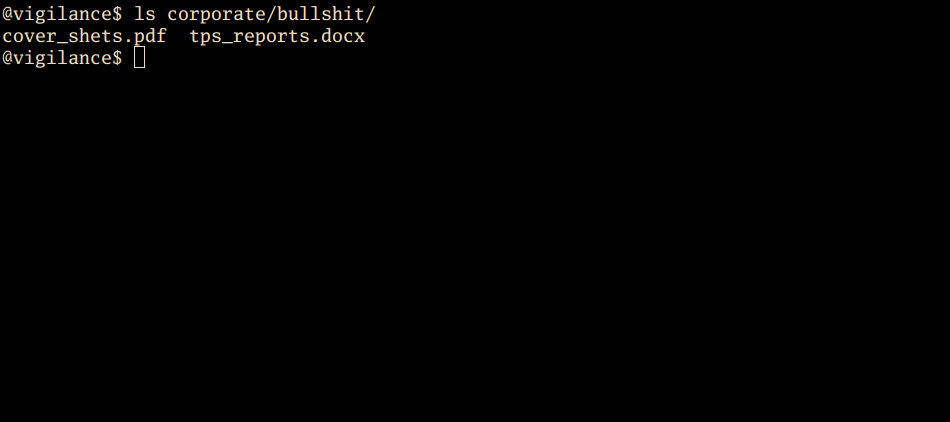
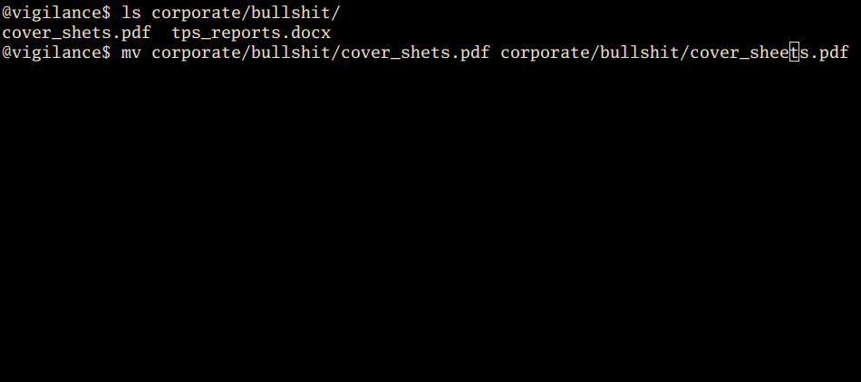
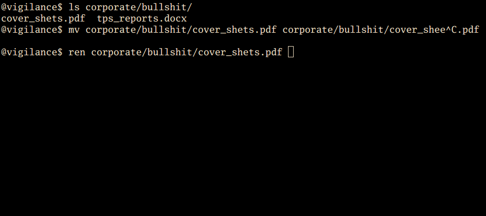
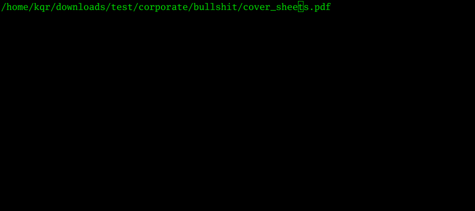
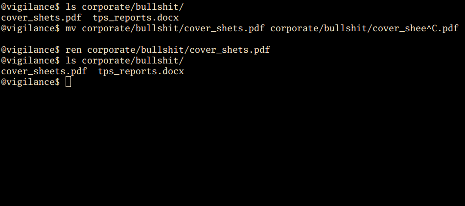

ren
===

`ren` is a simple utility to interactively rename a file in the command line
on Linuxy Unixy systems.


Motivation and Usage
--------------------

Imagine you have a couple of files a fair bit down in the directory tree, like
in this screenshot.



Finally! Finished up all those TPS reports and even included the cover she...
Damn it! I misspelled the file name. Boss will have my head for this!



No worries, I'll just type this mile long `mv` command where I have to type the
path twice because the relevant directory is not my working directory. I do this
because I'm a glutton for punishment.



But wait! I have this new fancy `ren` tool installed. Let's give it a shot.


Here's the main window. The file path is in red, which indicates a file with
that name already exists. (Obviously, in this case, since we've just started
the program, so the original file name is still filled in.) Currently, `ren`
will not allow you to overwrite an existing file while renaming a file. Press
escape to cancel.



Now I've corrected the name, and it's green to show me that there's no name
conflict. Press return to confirm.



We're out of `ren` again, and as you can see, the file has been renamed. If you
give multiple files as arguments to ren, it will prompt you for each file.


Building
--------

```
$ git clone git@github.com:kqr/ren.git
$ cd ren
$ stack install
```

